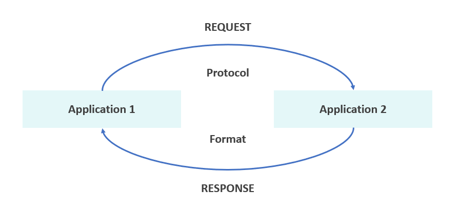

# APIs

## What are APIs? 

APIs (Application Programming Interfaces) allow different software applications to communicate and exchange data. 
They define the methods and data formats used for this interaction. 

### How are they used and why are they so popular?
They're used in mobile apps communication with
servers, websites getting data from databases and for integration for third-party services like payment gateways.

They're very popular due to their ease of integration and modularity. It also automates the process and supports 
scaling.

## Create a diagram to showcase the data transfer process in API communication.

## What is a REST API?  
A REST API is an interface that adheres to REST (Representational State Transfer) principles, allowing interaction 
using standard HTTP methods. 

### What are the REST guidelines?
- Use standard HTTP methods (GET, POST, PUT, DELETE, etc.). 
- Structure resources using URIs (e.g., /users/1). 
- Return responses in a format like JSON or XML. 
- Ensure idempotency for methods like GET and PUT.

### What makes an API RESTful?

- Statelessness: Each request is independent. 
- Client-Server Separation: Clients and servers operate independently. 
- Uniform Interface: Consistent communication methods. 
- Cacheable Responses: Responses can specify cacheability. 
- Layered System: Client doesn't need to know the server's architecture.

## What is HTTP? (what does it stand for and what is it used for? What is HTTPS?)
HTTP stands for HyperText Transfer Protocol. It is a protocol used for transferring hypertext (web pages) between 
servers and clients (browsers). HTTP is stateless, meaning each request is independent of previous ones.

HTTPS is the secure version of HTTP, where the "S" stands for Secure. It encrypts the communication between the client 
and the server, providing security for sensitive data like login credentials or payment details.

## Explain HTTP request structure using the diagrams provided, or your own.

## Explain HTTP response structure using the diagram provided, or your own.

## What are the 5 HTTP verbs and what do they do?

GET: Retrieve data from the server. It is a read-only operation.
- Example: GET /users/1 retrieves information about a user with ID 1.

POST: Send data to the server to create a new resource.
- Example: POST /users with user data in the request body to create a new user.

PUT: Update an existing resource entirely.
- Example: PUT /users/1 replaces the data of user 1 with new data.

PATCH: Partially update an existing resource.
- Example: PATCH /users/1 modifies only certain fields of user 1.

DELETE: Remove a resource from the server.
- Example: DELETE /users/1 deletes the user with ID 1.

## What is statelessness? Show examples of “stateless” and stateful http requests.
Statelessness means each request is independent. The server does not remember previous requests.
- Stateless: Each request stands alone. 
- Stateful: The server retains information between requests (e.g., user sessions).

## What is caching?
Caching stores copies of data to improve access speed and reduce server load. It uses headers like Cache-Control to 
manage cached content.